# EHS Safety Toolkit — Technical Review

**Prepared for**: Technical Review Presentation
**Date**: 26 February 2026
**Version**: 1.0.0
**Repository**: github.com/sagrado26/ehstoolkit

---

## 1. Executive Summary

The EHS Safety Toolkit is a full-stack web application for Environmental, Health, and Safety management in semiconductor manufacturing environments. It provides 8 integrated safety modules with real-time dashboards, 4-step safety plan wizards, risk assessment matrices, approval workflows, and PDF document generation — all within a single-page application.

**Current Status**: Production-ready, deployed on Railway
**Storage Mode**: In-Memory (PostgreSQL-ready via Drizzle ORM)

---

## 2. System Architecture

```
┌─────────────────────────────────────────────────────────────────┐
│                        CLIENT (Browser)                         │
│  React 18 + TypeScript + Vite + Tailwind CSS + shadcn/ui        │
│  Wouter (Routing) · TanStack Query (State) · Recharts (Charts)  │
└──────────────────────────┬──────────────────────────────────────┘
                           │ HTTP / JSON
┌──────────────────────────▼──────────────────────────────────────┐
│                     SERVER (Node.js 20)                          │
│  Express.js + TypeScript + Passport.js (Auth)                    │
│  8 Route Modules · Health Check · WebSocket                      │
└──────────────────────────┬──────────────────────────────────────┘
                           │ Drizzle ORM
┌──────────────────────────▼──────────────────────────────────────┐
│                   DATABASE (PostgreSQL 16)                        │
│  14 Tables · JSONB for assessments · Audit logging               │
│  Neon Serverless / Docker Compose / In-Memory fallback           │
└─────────────────────────────────────────────────────────────────┘
```

### 2.1 Technology Stack

| Layer | Technology | Purpose |
|-------|-----------|---------|
| **Frontend** | React 18, TypeScript | UI framework |
| **Styling** | Tailwind CSS 3.4, shadcn/ui | Component library + utility CSS |
| **State** | TanStack React Query v5 | Server state + caching |
| **Forms** | React Hook Form + Zod | Validation + schema-based forms |
| **Routing** | Wouter 3.x | Lightweight client-side routing |
| **Charts** | Recharts 2.x | Data visualization |
| **Animation** | Framer Motion | Page transitions + stagger effects |
| **Backend** | Express.js 4.x, Node.js 20 | REST API server |
| **ORM** | Drizzle ORM 0.39 | Type-safe database queries |
| **Auth** | Passport.js (Local Strategy) | Session-based authentication |
| **Database** | PostgreSQL 16 | Relational data store |
| **Build** | Vite 5.x, esbuild | Frontend + backend bundling |
| **Container** | Docker, Docker Compose | Deployment |
| **CI/CD** | GitHub Actions | Automated build + lint + Docker |

---

## 3. Application Pages & Navigation

### 3.1 Navigation Structure (Sidebar)

```
OVERVIEW
  └─ Dashboard              /

SAFETY
  ├─ Safety Plans            /safety-plan
  ├─ Safety Review Board     /safety-review-board
  ├─ Permit to Work          /permit-to-work
  └─ Incidents               /incidents

EQUIPMENT
  ├─ Crane Inspection        /crane-inspection
  └─ Draeger Calibration     /draeger-calibration

RESOURCES
  └─ Documentation           /documentation

ADMIN
  ├─ Admin                   /admin
  └─ Settings                /settings
```

### 3.2 Page Architecture

All pages use lazy-loading (`React.lazy`) for code-splitting. The layout wraps every authenticated page in:

```
AppShell
├── Sidebar (nav, 264px wide, collapsible on mobile)
├── DashboardHeader (page title, user info, date range)
└── Content Area (scrollable, max-width 1600px)
```

---

## 4. Module Details

### 4.1 Dashboard (`/`)

**Purpose**: Real-time overview of all safety metrics across the organization.

**Components**:
- **Hero Card** — Gradient banner with Safety Index score (0–100), trend indicator, search bar, "New Plan" CTA
- **5 Metric Cards** — Active Plans, Open Permits, Incidents, Crane Checks, Calibrations (clickable, link to each module)
- **Corrective Actions Chart** — Stacked bar chart (Plans/Permits/Incidents/Equipment × Completed/In Progress/Overdue)
- **H&S Culture Trend** — Dual-axis line chart (Safety Score + Report Count over 6 months)
- **Incidents by Type** — Donut chart with legend (Near Miss, Injury, Property Damage, Environmental)
- **Recent Safety Plans** — Table showing last 4 plans with status badges

**Data Sources**: Parallel queries to 5 API endpoints via `useQueries`

**Screenshot**: 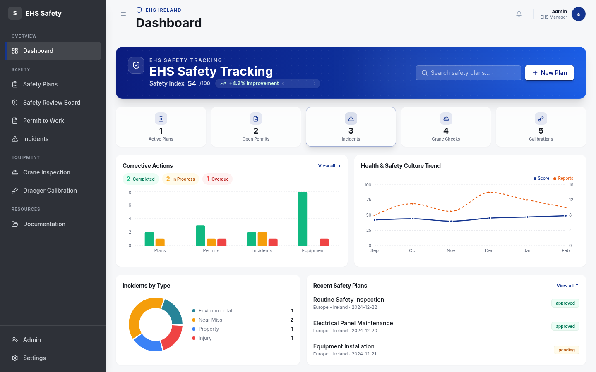

**Mobile view**: 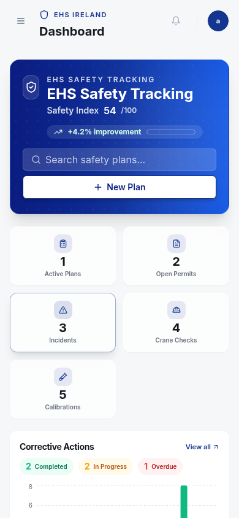

---

### 4.2 Safety Plan / ISP (`/safety-plan`)

**Purpose**: Integrated Safety Plan (ISP) — pre-task hazard assessment with 4-step wizard workflow.

#### 4.2.1 List View

Displays all submitted safety plans in a searchable, sortable table with status badges:
- **Draft** (gray) · **Pending** (amber) · **Approved** (emerald) · **Rejected** (red)
- Actions: View, Edit (team members only), Reuse (non-team), Start SRB (high risk)

**Screenshot**: 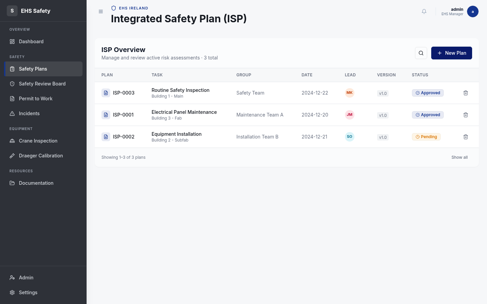

**Mobile view**: 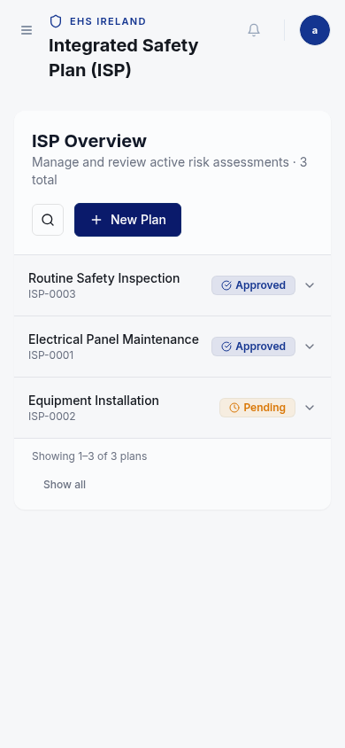

#### 4.2.2 Form Wizard (4 Steps)

**Step 1 — Task Details** (Modal dialog)
- Fields: Task Name, Location, Shift, Machine Number, System (EUV/DUV/CSCM/Trumph/Others), Group, Region, Date
- Social distancing compliance question
- Auto-populates from user preferences

**Step 2 — Pre-task Assessment** (11 Boolean Questions)
- Each question has Yes/No toggle with tooltip explanations
- Questions cover: Specialized Training, Chemicals, Other Work in Area, Falls, Barricades, LOTO, Heavy Lifting, Ergonomics, Head Injury Risk, Additional PPE, Other Concerns
- If all answers are "No", user can skip to Step 4 with confirmation

**Step 3 — Hazard Identification** (Risk Matrix)
- Select hazards from categorized catalog
- 4×4 Risk Matrix: Severity (1-4) × Likelihood (1-4)
- Risk levels: Low (1-3), Medium (4-7), High (8-11), Extreme (12-16)
- Mitigation plan text field per hazard
- Auto-flags: Checklist Required, Permit to Work Required

**Step 4 — Sign Off**
- Lead Assessor name (required)
- Approver name
- Team members (multi-select)
- Comments
- Preview before submission

**Desktop Layout**: Vertical stepper sidebar (left) + form card (right)
**Mobile Layout**: Horizontal progress bar (top) + form card (below)

**Screenshot — Step 1 (Task Details)**: 

#### 4.2.3 ISP Document View

Professional A4-format document (max-width: 210mm) with:

| Section | Content |
|---------|---------|
| **Header** | ASML logo, document title, ISP number (ISP-XXXX), status pill |
| **Info Boxes** | Date, Shift, Location, Machine (4-column grid with teal borders) |
| **Work Details & Team** | 6-column detail grid + Action Lead + Team Members |
| **Safety Requirements** | Flagged safety concerns with colored icons + cleared count |
| **Risk Assessment** | Hazard cards with severity/likelihood scores, color-coded borders, mitigation plans |
| **Required Documents** | Checklists and Permits to Work linked to specific hazards |
| **Authorization** | Clean table: Role / Name / Date / Status |

**Print to PDF**: Ctrl+P or "Print to PDF" button. CSS `@media print` preserves:
- A4 page size (210mm × 297mm)
- Side-by-side columns maintained
- Background colors preserved (`print-color-adjust: exact`)
- Sidebar/header hidden via `.no-print` class

**Screenshot**: 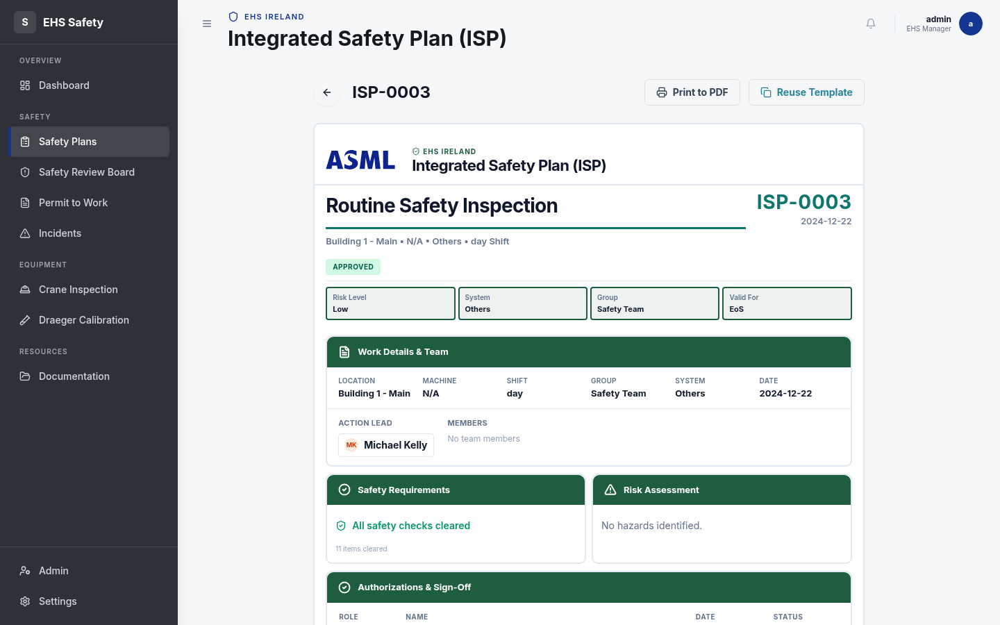

---

### 4.3 Safety Review Board (`/safety-review-board`)

**Purpose**: Escalation workflow for high-risk hazards (risk score ≥ 8).

**Workflow**:
1. Triggered from Safety Plan view when hazards score ≥ 8
2. Pre-questions: Reason for escalation, procedure details, service order number
3. Hazard reassessment with additional safety measures
4. Team acknowledgement (6 checkboxes)
5. Multi-role sign-off (EHS Specialist, Fab Team Lead, CS Management)

**Data Model**: `srb_records` table with JSONB fields for pre-questions, reassessments, acknowledgements, and signatories

**Screenshot**: 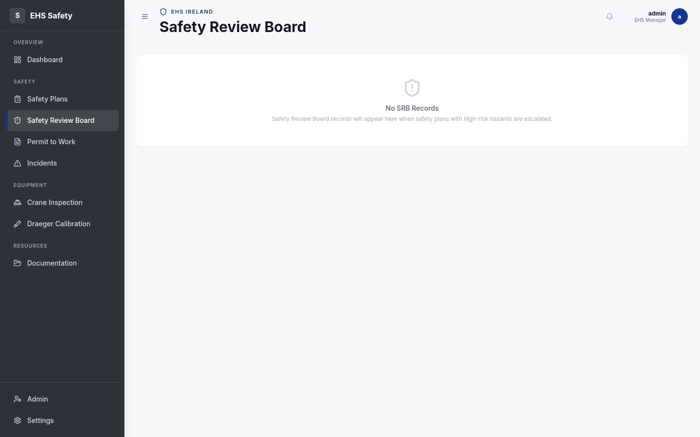

---

### 4.4 Permit to Work (`/permit-to-work`)

**Purpose**: Work authorization and safety clearance for controlled operations.

**Permit Types**:
- General Work Permit
- Confined Space Entry
- Hazardous Space Operations
- Hazardous Chemicals Handling

**Features**:
- 5 safety pre-check questions (spq1–spq5)
- Gas measurement panel (O₂, CO₂, CO, H₂S, LEL levels)
- Multi-level approval workflow (Submitter → Manager → Authority)
- Digital signature capture
- Linked to Safety Plans

**Database Tables**: `permits`, `permit_gas_measurements`, `permit_approvals`, `permit_sign_offs`

**Screenshot**: 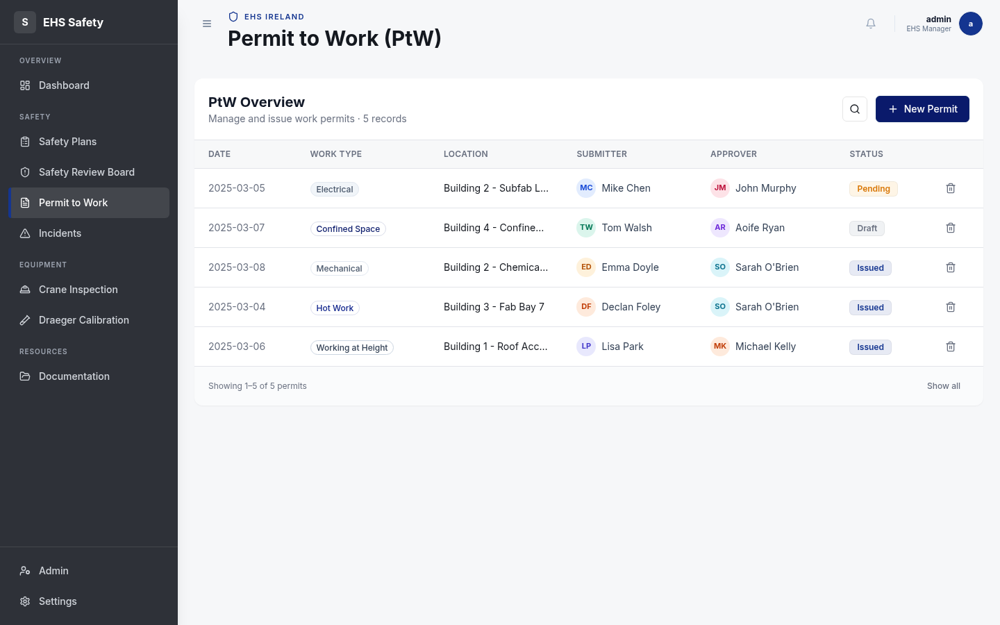

---

### 4.5 Crane Inspection (`/crane-inspection`)

**Purpose**: Equipment safety verification and tracking for overhead cranes.

**Fields**: Inspector, Buddy Inspector, Bay, Machine, Date, 3 inspection questions
**Status**: Draft → Submitted

**Screenshot**: 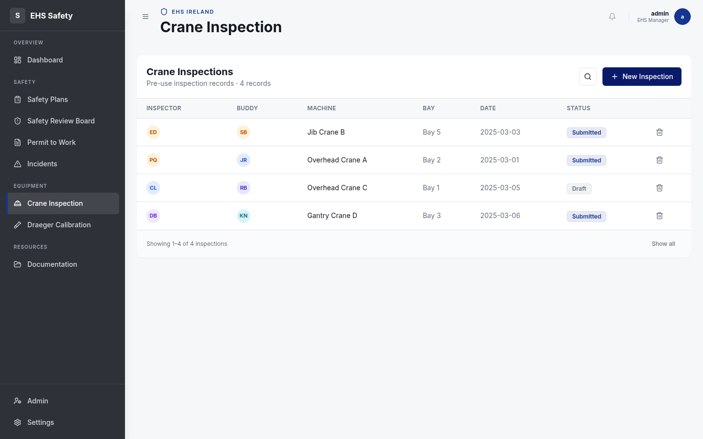

---

### 4.6 Draeger Calibration (`/draeger-calibration`)

**Purpose**: Gas detection device maintenance and calibration records.

**Fields**: NC-12 number, Serial Number, Calibration Date, Calibrated By
**Tracking**: Last calibration date, next due date

**Screenshot**: 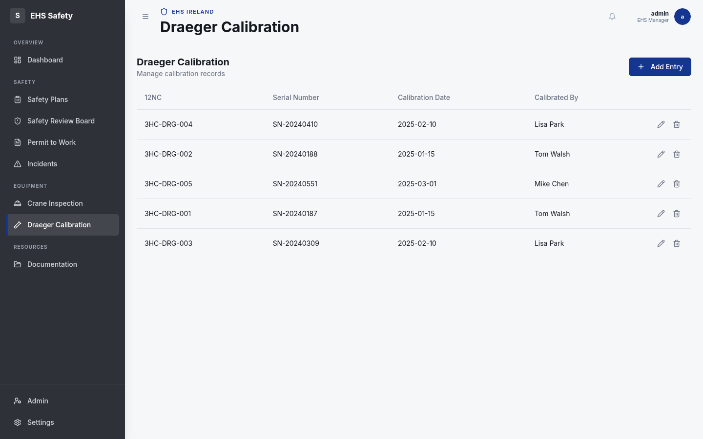

---

### 4.7 Incidents (`/incidents`)

**Purpose**: Safety incident reporting, investigation tracking, and resolution.

**Incident Types**: Near Miss, Injury, Property Damage, Environmental
**Severity Scale**: 1–5
**Status Flow**: Open → Investigating → Closed
**Fields**: Date, Type, Location, Description, Severity, Assigned Investigator

**Screenshot**: 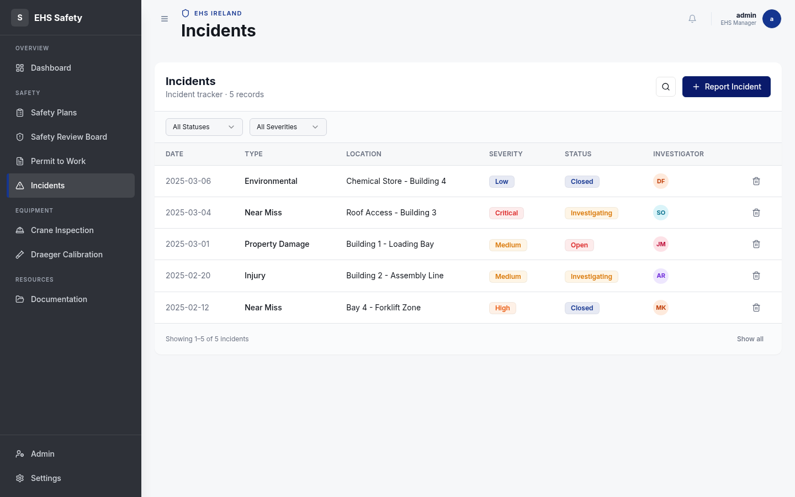

---

### 4.8 Documentation (`/documentation`)

**Purpose**: Centralized safety document library with SharePoint integration.

**Fields**: Title, Category, Description, SharePoint URL

**Screenshot**: 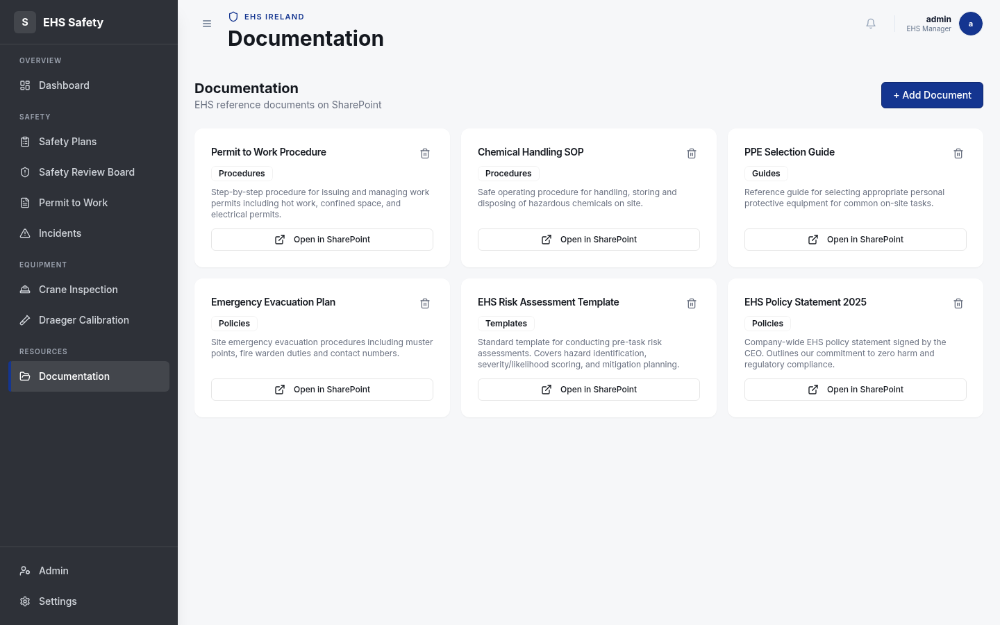

---

## 5. Database Schema (14 Tables)

```sql
-- Authentication & Preferences
users                    -- Authentication (id, username, password)
user_preferences         -- Settings (system, group, site, role)

-- Safety Plans
safety_plans             -- ISP records (30+ fields, JSONB hazards/assessments)
report_list              -- Versioned JSON reports (job details, risk, SRB, approval)
audit_logs               -- Action history (action, performer, changes JSONB)

-- Permit to Work (4 linked tables)
permits                  -- PtW records (4 permit types, gas fields, SRB fields)
permit_gas_measurements  -- O₂/CO₂/CO/H₂S/LEL readings per permit
permit_approvals         -- Multi-role approval chain
permit_sign_offs         -- Digital signatures

-- Other Safety Modules
srb_records              -- Safety Review Board (pre-questions, reassessments, acks)
crane_inspections        -- Crane safety checks
draeger_calibrations     -- Gas detector calibration records
incidents                -- Safety event records
documents                -- Document library with SharePoint links
```

### Key Schema Patterns
- **JSONB columns** for flexible nested data (hazards, assessments, pre-questions)
- **Zod schemas** auto-generated from Drizzle table definitions (`createInsertSchema`)
- **Audit logging** captures field-level changes with before/after values
- **Version tracking** via `report_list` for compliance history

---

## 6. API Endpoints

| Method | Endpoint | Module |
|--------|----------|--------|
| GET | `/api/health` | System health check |
| GET/POST | `/api/safety-plans` | Safety Plans CRUD |
| PUT | `/api/safety-plans/:id` | Update plan |
| GET/POST | `/api/permits` | Permits CRUD |
| GET/POST | `/api/crane-inspections` | Crane Inspections CRUD |
| GET/POST | `/api/draeger-calibrations` | Draeger Calibrations CRUD |
| GET/POST | `/api/incidents` | Incidents CRUD |
| GET/POST | `/api/documents` | Documents CRUD |
| GET/POST | `/api/srb` | Safety Review Board CRUD |
| GET | `/api/audit-logs` | Audit log queries |
| GET/PUT | `/api/user-preferences/:userId` | User preferences |
| POST | `/api/login` | Authentication |
| POST | `/api/logout` | Session termination |

---

## 7. CI/CD Pipeline

**File**: `.github/workflows/ci.yml`

```
Push/PR to main
    ├── Test Job
    │   ├── Checkout → Setup Node 20 → npm ci
    │   ├── TypeScript type check (npm run check)
    │   ├── Build application (npm run build)
    │   └── Run tests
    │
    ├── Lint Job
    │   └── ESLint on .ts/.tsx files
    │
    └── Docker Job
        └── Build Docker image (verify compilation)
```

**Trigger**: Every push or PR to `main` branch
**Infrastructure**: GitHub-hosted Ubuntu runners + PostgreSQL 16 service container

---

## 8. Deployment Architecture

### 8.1 Current Deployment
- **Platform**: Railway (auto-deploy from GitHub)
- **Database**: Neon PostgreSQL (serverless)
- **Build**: `vite build` + `esbuild` server bundle
- **Runtime**: `node dist/index.js`

### 8.2 Docker Configuration
```
.devcontainer/
├── devcontainer.json     # VS Code dev container
├── docker-compose.yml    # Dev: Node 20 + PostgreSQL 16
├── Dockerfile            # Dev image
└── post-create.sh        # Auto-setup script

docker/
├── Dockerfile            # Production multi-stage build
├── docker-compose.dev.yml
├── docker-compose.prod.yml
├── docker-compose.yml
└── init.sql
```

### 8.3 Build Pipeline
```bash
npm run build
# 1. vite build        → client/dist/ (React SPA)
# 2. esbuild bundle    → dist/index.js (Express server)

npm run start
# NODE_ENV=production node dist/index.js
# Serves SPA + API on single port
```

---

## 9. Design System

### 9.1 Brand Colors (ASML)
| Token | Hex | Usage |
|-------|-----|-------|
| `brand` (Primary) | `#0F238C` | Headers, buttons, sidebar |
| `brand-dark` | `#0A1A6B` | Sidebar gradient, hover states |
| `brand-light` | `#1E3AAF` | Active states |
| `brand-signal` | `#E8590C` | Alerts, high-impact CTAs |
| Teal | `#288498` / `#1e5e3f` | Safety badges, ISP section headers |

### 9.2 Typography
| Font | Family | Usage |
|------|--------|-------|
| Plus Jakarta Sans | `font-display` | Headings, labels |
| IBM Plex Sans | `font-sans` | Body text (default) |
| JetBrains Mono | `font-mono` | Data, numbers, codes |

### 9.3 Component Patterns
- **Cards**: `rounded-xl shadow-sm` with left-border color coding by risk level
- **Tables**: `hover:bg-brand/[0.03]` row hover
- **Status Badges**: Emerald (approved), Amber (pending), Red (rejected), Gray (draft)
- **Buttons**: `bg-brand hover:bg-brand/90` for primary actions
- **Page Animations**: Framer Motion stagger (0.06s between children)

---

## 10. Security

| Feature | Implementation |
|---------|---------------|
| Authentication | Passport.js local strategy with express-session |
| Input Validation | Zod schemas on every API endpoint |
| SQL Injection | Parameterized queries via Drizzle ORM |
| Session Management | Server-side sessions with configurable store |
| Role-based Access | User preferences with role field |
| HTTPS | SSL/TLS at deployment platform level |
| Audit Trail | Full action logging with field-level change tracking |

---

## 11. Mobile Responsiveness

| Breakpoint | Layout |
|------------|--------|
| `< 1024px` (mobile) | Sidebar collapses to slide-over overlay; hamburger menu in header |
| `≥ 1024px` (desktop) | Fixed 264px sidebar + fluid content area |
| **Safety Plan Form** | Mobile: horizontal stepper bar; Desktop: vertical sidebar stepper |
| **Dashboard Cards** | Mobile: 2-column grid; Desktop: 5-column grid |
| **ISP Document** | Constrained to A4 width (210mm) on all screen sizes |

---

## 12. Key Workflows

### 12.1 Safety Plan Lifecycle

```
New Plan → Step 1 (Task Details Modal)
         → Step 2 (Pre-task Assessment: 11 Yes/No questions)
         → Step 3 (Hazard ID: risk matrix + mitigation)
         → Step 4 (Sign Off: lead, approver, team)
         → Preview → Submit
         → Status: Pending
         → Approver reviews → Approved / Rejected
         → If high risk (score ≥ 8) → Trigger SRB
```

### 12.2 Permit to Work Lifecycle

```
Create Permit → Select Type → Fill Safety Questions
              → Gas Measurements (if applicable)
              → Multi-level Approval Chain
              → Digital Signatures
              → Status: Active / Expired
```

### 12.3 Incident Management

```
Report Incident → Type + Severity + Location
               → Assign Investigator
               → Status: Open → Investigating → Closed
               → Feeds dashboard metrics
```

---

## 13. File Structure (Key Files)

```
client/src/
├── App.tsx                          # Routes + providers
├── index.css                        # Global styles + print CSS
├── components/
│   ├── layout/
│   │   ├── AppShell.tsx             # Main layout wrapper
│   │   └── Sidebar.tsx              # Navigation sidebar
│   ├── DashboardHeader.tsx          # Top header bar
│   ├── SafetyPlanDetail.tsx         # ISP document renderer
│   └── ui/                          # shadcn/ui components (30+)
├── features/
│   ├── safety-plan/
│   │   ├── components/
│   │   │   ├── InitialDetailsStep   # Step 1: Job details
│   │   │   ├── SafetyCheckStep      # Step 2: 11 boolean questions
│   │   │   ├── HazardIDStep         # Step 3: Risk matrix
│   │   │   ├── SignOffStep          # Step 4: Authorization
│   │   │   ├── StepperBar           # Progress indicator
│   │   │   ├── SafetyPlanList       # Plan table view
│   │   │   ├── SafetyPlanView       # ISP document wrapper
│   │   │   └── PreviewModal         # Pre-submit preview
│   │   ├── types.ts                 # TypeScript interfaces
│   │   ├── risk-utils.ts            # Risk scoring + question definitions
│   │   └── hazard-data.ts           # Hazard catalog
│   ├── permit-to-work/              # PtW form + list
│   ├── safety-review-board/         # SRB workflow
│   ├── crane-inspection/            # Crane checks
│   ├── draeger-calibration/         # Gas detector calibration
│   ├── incidents/                   # Incident management
│   └── documentation/               # Document library
├── pages/
│   ├── DashboardPage.tsx            # Main dashboard
│   ├── SafetyPlanPage.tsx           # ISP orchestrator (list/form/view)
│   ├── PermitToWorkPage.tsx
│   ├── SRBPage.tsx
│   ├── CraneInspectionPage.tsx
│   ├── DraegerCalibrationPage.tsx
│   ├── IncidentsPage.tsx
│   ├── DocumentationPage.tsx
│   ├── AdminPage.tsx
│   ├── LoginPage.tsx
│   └── settings.tsx
└── hooks/
    ├── use-auth.tsx                 # Auth context
    ├── use-theme.tsx                # Theme + nav color
    ├── use-sidebar.tsx              # Mobile sidebar state
    └── use-toast.ts                 # Toast notifications

server/
├── index.ts                         # Entry point (dev)
├── index.prod.ts                    # Entry point (production)
├── routes.ts                        # Route registration
├── storage.ts                       # Data access layer
├── db.ts                            # Database connection
└── routes/
    ├── auth.ts                      # Login/logout/register
    ├── safety-plans.ts              # ISP CRUD + audit
    ├── permits.ts                   # PtW CRUD + gas + approvals
    ├── srb.ts                       # SRB CRUD
    ├── crane-inspections.ts         # Crane CRUD
    ├── draeger-calibrations.ts      # Draeger CRUD
    ├── incidents.ts                 # Incident CRUD
    └── documents.ts                 # Document CRUD

shared/
└── schema.ts                        # 14 tables + Zod schemas + types
```

---

## 14. Screenshots

All screenshots captured from the running application at `http://localhost:3000`. Files are in the `screenshots/` directory.

### Desktop Views (1440 x 900)

#### Dashboard

*Hero card with Safety Index, 5 metric tiles, corrective actions bar chart, H&S culture trend line, incidents donut chart, recent safety plans table.*

#### Safety Plan List (ISP)

*Sortable table with ISP number, task name, group, date, lead avatar, version, and status badges (Approved/Pending).*

#### ISP Document View

*A4-format document with ASML header, work details grid, safety requirements, risk assessment, and authorization sign-off table.*

#### New Plan Wizard — Step 1

*Modal dialog: Task Name (type + freetext), Shift, Location, Machine Number dropdowns.*

#### Safety Review Board

*Empty state — records appear when high-risk hazards (score >= 8) are escalated from Safety Plans.*

#### Permit to Work

*5 permits with work type badges (Electrical, Confined Space, Mechanical, Hot Work, Working at Height), submitter/approver avatars, status.*

#### Incidents

*5 incident records with severity badges (Low/Medium/High/Critical), status filters, investigator avatars.*

#### Crane Inspection

*4 inspection records with inspector/buddy avatars, machine type, bay, date, and status.*

#### Draeger Calibration

*5 calibration records with 12NC codes, serial numbers, dates, and edit/delete actions.*

#### Documentation

*6 document cards (Procedures, Guides, Policies, Templates) with SharePoint links.*

### Mobile Views (390 x 844 — iPhone 14)

#### Dashboard Mobile

*Responsive layout: sidebar hidden, stacked metric cards (2-col grid), full-width charts.*

#### Safety Plan List Mobile

*Card-based layout replacing the desktop table, with plan name, ISP number, and status badge.*

---

## 15. Dependencies Summary

### Production (79 packages)
| Category | Packages |
|----------|----------|
| **UI Framework** | react, react-dom, wouter |
| **UI Components** | 20+ @radix-ui packages, shadcn/ui, lucide-react |
| **State** | @tanstack/react-query |
| **Forms** | react-hook-form, @hookform/resolvers, zod |
| **Charts** | recharts |
| **Animation** | framer-motion |
| **Backend** | express, express-session, passport, passport-local |
| **Database** | drizzle-orm, @neondatabase/serverless, pg |
| **Styling** | tailwind-merge, clsx, class-variance-authority |

### Development (16 packages)
| Category | Packages |
|----------|----------|
| **Build** | vite, esbuild, @vitejs/plugin-react |
| **Types** | typescript 5.6, @types/* packages |
| **CSS** | tailwindcss, autoprefixer, postcss |
| **DB Tools** | drizzle-kit |
| **Runtime** | tsx, cross-env |

---

## 16. Roadmap

### Near-term (In Progress)
| Item | Status | Notes |
|------|--------|-------|
| **M365 OAuth Authentication** | Ready to enable | Full implementation in `server/config/M365_OAUTH_IMPLEMENTATION.md`; requires Azure AD app registration and env vars (`M365_CLIENT_ID`, `M365_CLIENT_SECRET`, `M365_TENANT_ID`) |
| **SharePoint Integration** | Scaffolded | Document library already links to SharePoint URLs; needs live API connection for real-time sync |
| **Email Notifications** | Planned | SMTP alerts for permit approvals, SRB escalations, overdue corrective actions |
| **Unit & E2E Testing** | Planned | Vitest for unit tests, Playwright for browser E2E; CI pipeline already has test job placeholder |

### Mid-term
| Item | Notes |
|------|-------|
| **Real-time Notifications** | WebSocket (`ws` already installed) push for approval status, SRB alerts |
| **Advanced Reporting** | Custom dashboard builder with exportable PDF/Excel reports |
| **Audit Dashboard** | Dedicated admin view for compliance trail; `audit_logs` table already captures field-level changes |
| **Role-based Access Control** | Granular permissions per module (viewer, editor, approver, admin); `user_preferences` already has `role` field |
| **PostgreSQL Full Deployment** | Migrate from in-memory fallback to persistent PostgreSQL; Drizzle schema and Docker Compose already configured |

### Long-term
| Item | Notes |
|------|-------|
| **Mobile Companion App** | React Native for on-site inspections and offline form submission |
| **Offline Mode (PWA)** | Service worker for areas with poor connectivity; responsive layout already mobile-ready |
| **Multi-tenant Support** | Organization-level data isolation for multi-site ASML deployments |
| **Analytics & ML** | Trend prediction for incident rates, risk scoring recommendations |
| **Third-party Integrations** | SAP, ServiceNow, and BMS system connectors |

---

*Document generated from codebase analysis — EHS Safety Toolkit v1.0.0 — Screenshots captured 26 Feb 2026*
